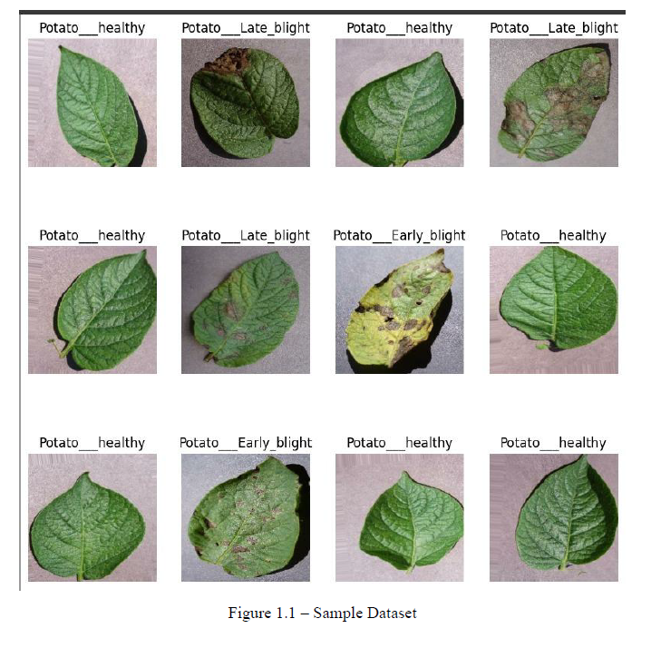
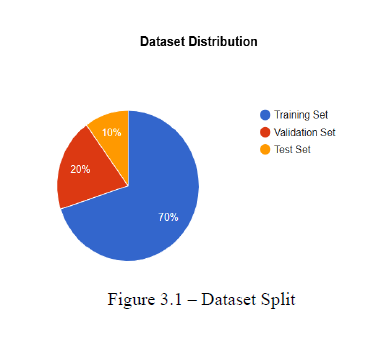
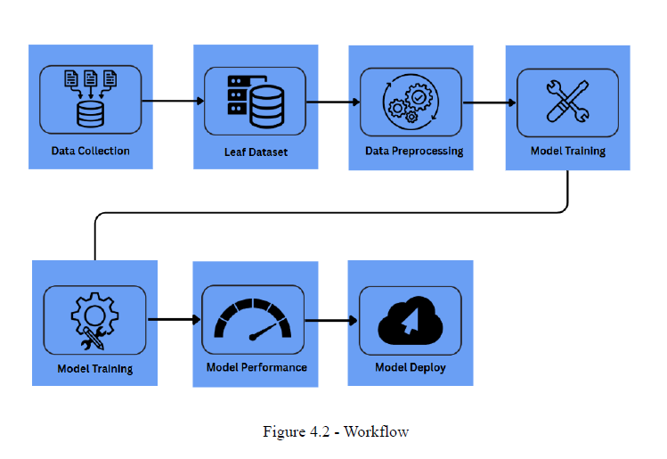
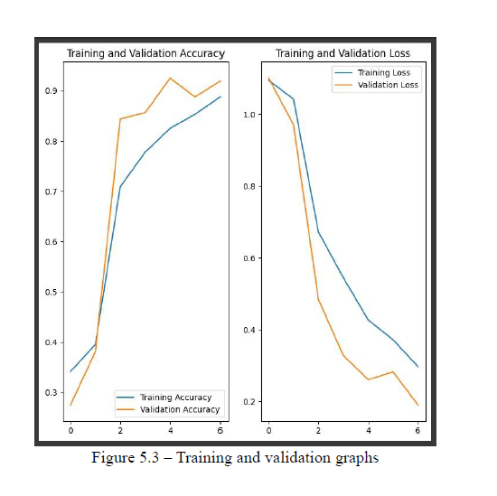
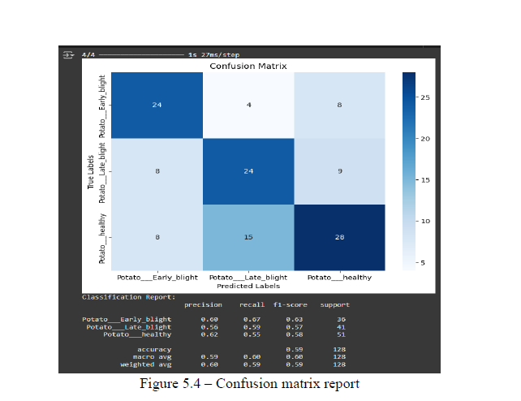

# Potato Disease Classification using Deep Learning

Web applications powered by a Convolutional Neural Network (CNN) deep learning model to provide real-time classification of potato plant diseases (healthy, late blight, early blight), empowering farmers with early detection for intervention and prevention.

## Table of Contents

1. [Introduction](introduction)
2. [Key Technologies and Skills](Skills)
3. [Installation](Installation)
4. [Dataset](Dataset)
5. [Workflow](Workflow)
6. [Test](Test)
7. [Features](Features)

## Introduction

In the agriculture industry, farmers often face challenges in identifying diseases in potato plants, such as early blight, late blight, or determining if the plant is healthy. This uncertainty makes it difficult for farmers to apply the appropriate fertilizers and treatments, impacting crop yield and quality. By leveraging machine learning technology, our solution aims to improve agricultural practices, optimize resource allocation, and ultimately enhance the production of healthy potato plants.

Trained the model on a 9,000-image dataset, meticulously divided into three classes (healthy, late blight, early blight), using a 70/30 train-test split for robust validation.
Improved model accuracy from 66.8% to 86.9% in Stage 1 and further to 89.2% in Stage 2, achieving a 33% overall increase.
Optimized training by reducing epochs from 9 to 5, effectively preventing model overfitting and memorization of training data, and cutting training time from 20 minutes to 11 minutes (a 45% reduction).


## Key Technologies and Skills
- Python
- TensorFlow
- Convolutional Neural Network (CNN)
- Keras
- Numpy
- Matplotlib
- Streamlit


## Installing and Running

```
pip install -r requirements.txt
```
```
streamlit run app.py
```

## Dataset
 


## Workflow
 

## Test



## Features

#### Data Collection:
   - This dataset consists of images depicting diseased potato plant leaves, meticulously labeled into categories such as early blight, healthy, and late blight.

   - This collection serves as a valuable asset for training and evaluating our deep learning model, facilitating the development of an effective solution for potato disease classification.

📙 Dataset Link: [https://www.kaggle.com/datasets/emmarex/plantdisease](https://www.kaggle.com/datasets/emmarex/plantdisease)


#### Preprocessing:

   - **Image Reading and Resizing:** Initiate the preprocessing phase by leveraging TensorFlow to read all images from the directory. Each image undergoes resizing to a standardized dimension of 256x256 pixels. Furthermore, organize the processed images into batches with a size of 32, thus forming a structured dataset ready for subsequent analysis.

   - **Dataset Splitting:** To facilitate comprehensive model evaluation, partition the dataset into three distinct subsets: training, validation, and testing. This segmentation ensures the robustness of our model's performance assessment by enabling separate training, validation, and testing phases, thus minimizing the risk of overfitting and enhancing generalization capabilities.

   - **Data Pipeline Optimization:** In pursuit of efficient model training, optimize the data pipeline using TensorFlow's built-in functionalities. The `cache` function is strategically employed to circumvent the repetitive loading and reading of training images across epochs. Concurrently, the `prefetch` function enhances training speed by proactively preparing subsequent batches of training images. These optimizations collectively streamline the training process, resulting in significant time savings and improved computational efficiency.


#### Model Building and Training:

   - **Model Building:** Construct the model architecture using Keras, incorporating layers for resizing, rescaling, random flip, and random rotation to preprocess the input images. Additionally, a Convolutional Neural Network (CNN) architecture is implemented, comprising convolutional layers, pooling layers, and dense layers with adjustable filters/units and activation functions.

   - **Training:** During model training, we utilize the `Adam` optimizer, `sparse_categorical_crossentropy` loss function, and `Accuracy` metrics to optimize and evaluate the model's performance. The training process involves evaluating the model's performance on the validation dataset after each epoch, culminating in a final evaluation on the testing dataset. Upon completion of training, the model achieves an impressive accuracy of **95.8%**, signifying its capability to accurately classify potato disease images.


#### Model Deployment and Inference:
   - Following the completion of model training and evaluation, the trained model is saved to enable seamless deployment and inference on new images for classification purposes. To facilitate this process, a user-friendly Streamlit application is developed and deployed on the Hugging Face platform. 
   - This application empowers users to upload new images and obtain real-time classification results, providing a convenient interface for leveraging the model's capabilities in practical scenarios.

